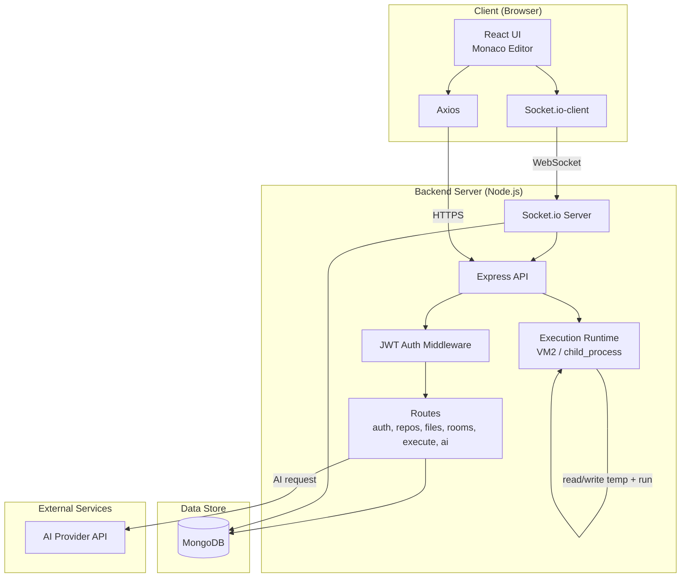
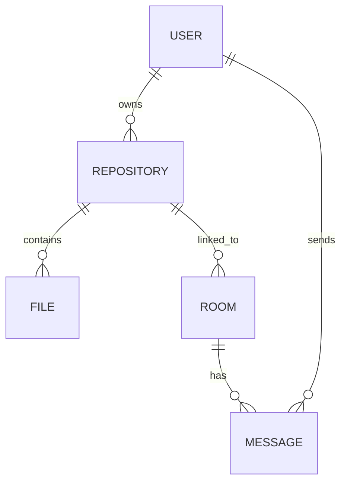
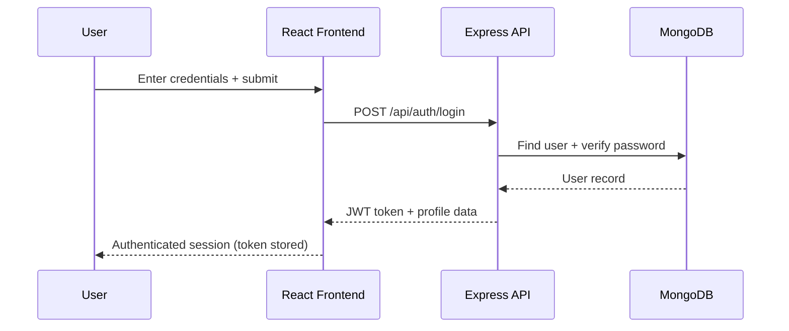
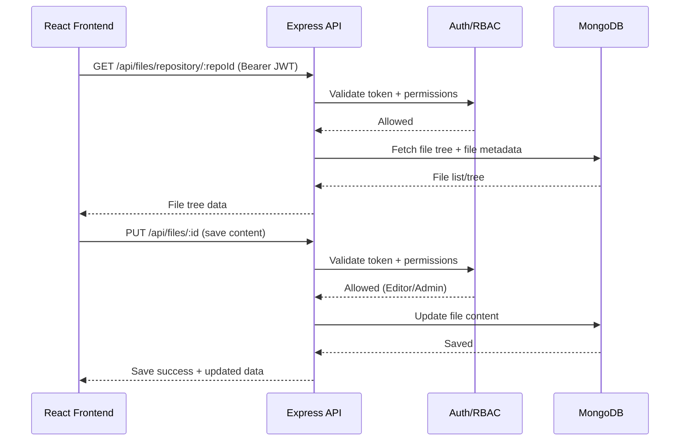
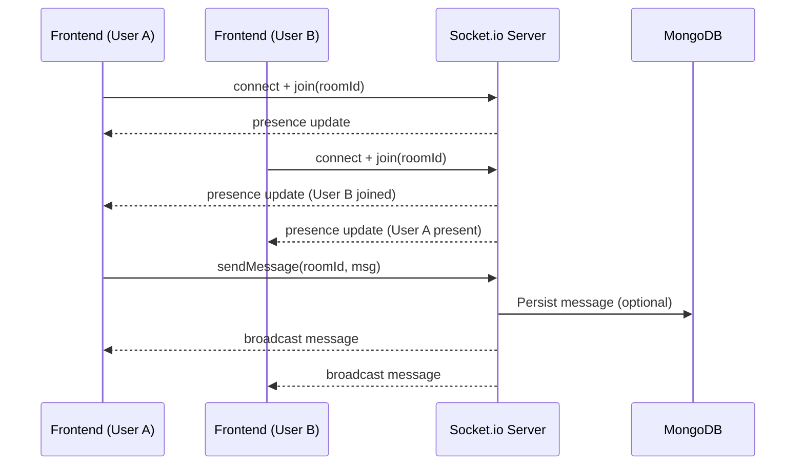
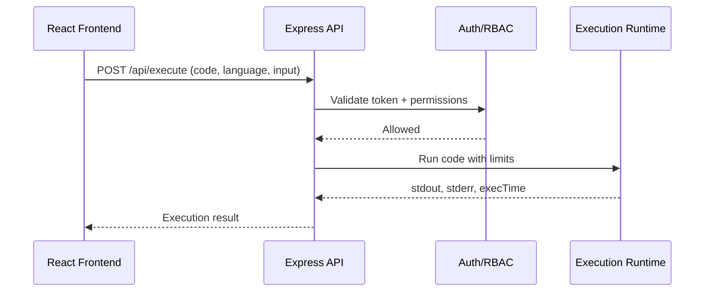

# 1. INTRODUCTION

CodeCollab is a full-stack web application that provides a browser-based environment for writing, organizing, running, and collaborating on source code in real time. The platform combines a modern code editor experience (Monaco Editor) with repository/file management, secure user authentication, and live collaboration features such as room-based sessions, chat, and presence tracking. In addition, CodeCollab supports executing programs in multiple languages from within the application, returning program output and execution information to help users rapidly test and validate code. The system is built with a React frontend and a Node.js/Express backend, uses MongoDB for persistence, and leverages Socket.io for real-time interactions.

## 1.1 Project Description

The goal of CodeCollab is to streamline collaborative programming by unifying core development activities into one web platform. Users can register and log in using JWT-based authentication, then create and manage repositories that contain files and folders. Within each repository, users edit code using an IDE-like interface with syntax highlighting across many popular languages. Collaboration is enabled through real-time rooms, allowing multiple participants to coordinate work while communicating via integrated chat and viewing each other’s presence in the session. Code execution is provided as a backend service: users submit code (and optional input), the server runs the program in a controlled environment, and returns results including output and execution time. Role-based access control (Viewer, Editor, Admin) ensures that users interact with repositories and collaboration sessions according to assigned permissions.

## 1.2 Scope of the Project

The scope of this project includes the following functional areas:

- **User Authentication and Authorization**
  - Supports **user registration and login** to create a secure identity for each participant.
  - Uses **JWT-based authentication** to protect API endpoints and maintain user sessions.
  - Enforces **role-based access control** (Viewer, Editor, Admin) so permissions match user responsibilities.

- **Repository and File Management**
  - Allows users to **create, view, update, and delete repositories** to organize projects.
  - Provides **file and folder management** to structure codebases similar to real development workflows.
  - Stores repository and file data **persistently in MongoDB**, enabling retrieval across sessions.
  - Enables **sharing/collaboration access** so multiple users can work within the same repository context.

- **Web-based Code Editing**
  - Integrates the **Monaco Editor** to deliver an IDE-like coding experience in the browser.
  - Provides **syntax highlighting for multiple languages** to improve readability and reduce mistakes.
  - Includes **file tree navigation** to switch between files efficiently during development.
  - Supports **real-time saving** so changes are preserved and reflected consistently.

- **Real-time Collaboration**
  - Supports **room creation and joining** to structure collaboration into sessions.
  - Includes **real-time chat messaging** to coordinate work without leaving the editor.
  - Implements **presence tracking** to show which users are currently active in a collaboration room.

- **Code Execution Service**
  - Executes programs in **multiple languages** (e.g., JavaScript/TypeScript, Python, Java, C/C++, Go, Rust, Ruby, PHP) from the platform.
  - Handles **stdin input and stdout/stderr output** so users can test interactive programs.
  - Reports **execution time** to give feedback on runtime behavior and performance.
  - Uses **sandboxing/safety controls** (e.g., VM2) to reduce risk when running untrusted code.

- **Out of Scope / Future Enhancements (Planned)**
  - **Shared cursor positions** and richer live co-editing indicators.
  - **Collaborative drawing/whiteboard** features for diagrams and problem-solving.
  - **Advanced AI features**, such as richer code completion and suggestions beyond the current AI assistant.
  - **Repository export (ZIP download)** for portability and offline use.


# 2. LITERATURE SURVEY

This section summarizes existing approaches to collaborative coding and identifies how CodeCollab improves upon common limitations by integrating collaboration, repository management, and code execution into a single web platform.

## 2.1 Existing and Proposed System

### Existing System (Current Approaches)

- **Traditional IDEs + Git-based collaboration**
  - Teams typically write code locally (VS Code/IntelliJ/Eclipse) and collaborate through Git workflows (commit, push, pull requests).
  - Strength: strong versioning and review processes.
  - Limitation: collaboration is mostly asynchronous; real-time coordination requires external tools.

- **Remote collaboration extensions (e.g., “live share”-style tools)**
  - Real-time co-editing is enabled through plugins on desktop IDEs.
  - Strength: high-quality editing experience and live pairing support.
  - Limitation: setup depends on compatible IDEs, extensions, and network conditions; not always ideal for quick access or learning environments.

- **Browser-based coding platforms**
  - Web IDEs allow editing and sometimes running code in a browser.
  - Strength: easy access, minimal installation.
  - Limitation: many platforms either focus on execution only (without strong repo/file management) or require separate communication channels for collaboration.

- **Standalone communication tools**
  - Teams commonly rely on chat/voice/video apps (Slack/Teams/Meet) for coordination.
  - Strength: effective communication.
  - Limitation: context switching between editor and communication reduces productivity and increases cognitive load.

### Proposed System (CodeCollab)

- **Unified workspace**
  - Combines repository/file management, editing, collaboration rooms, chat, and execution into one application.

- **Real-time collaboration layer**
  - Socket.io enables room-based collaboration with presence tracking and live messaging for synchronous teamwork.

- **Secure, role-based access**
  - JWT authentication plus roles (Viewer/Editor/Admin) support controlled sharing and permissioned collaboration.

- **Multi-language execution**
  - Backend execution service runs programs in multiple languages, returning output, error streams, and execution timing for rapid feedback.

- **Extensible roadmap**
  - Planned enhancements (shared cursors, whiteboard, AI assistance, export) build toward richer collaboration and learning workflows.

## 2.2 Feasibility Study

### Technical Feasibility

- **Architecture feasibility**
  - The selected stack (React + Node.js/Express + MongoDB + Socket.io) is widely used and well-supported, making implementation and maintenance practical.

- **Real-time communication feasibility**
  - Socket.io provides stable event-based communication suitable for chat, presence, and room coordination.

- **Code execution feasibility**
  - Execution is handled on the server side, enabling consistent runtime environments and better control over resource usage.
  - Sandboxing controls (e.g., VM2 and process constraints) reduce risk when executing untrusted code, although production hardening is required for strict isolation.

### Operational Feasibility

- **Usability**
  - A web-based UI reduces onboarding time: users only need a browser and an account.

- **Deployment and maintenance**
  - The system can be deployed as separate frontend and backend services and scaled independently (API, database, real-time server).

- **Collaboration workflow**
  - Rooms, chat, and presence support practical team workflows such as pair programming, mentoring, and group problem-solving.

### Economic Feasibility

- **Low-cost development**
  - The project relies on open-source technologies (React, Express, MongoDB, Socket.io, Monaco Editor), minimizing licensing costs.

- **Infrastructure cost control**
  - Costs are primarily hosting and database usage; the main cost driver is code execution compute time.
  - The platform can begin with local development or small cloud instances and scale as usage grows.

## 2.3 Hardware and Software Requirements

### Hardware Requirements

- **Client (User)**
  - Processor: Dual-core CPU or higher
  - RAM: 4 GB minimum (8 GB recommended)
  - Storage: No special requirement (browser-based), minimal cache/storage
  - Network: Stable internet connection for real-time collaboration

- **Server (Deployment)**
  - Processor: 2+ vCPU recommended (more for frequent code execution)
  - RAM: 4 GB minimum (8 GB+ recommended for multiple concurrent rooms/executions)
  - Storage: SSD recommended for logs, uploads, and runtime files
  - Network: Reliable bandwidth/latency for Socket.io real-time events

### Software Requirements

- **Client (User)**
  - OS: Windows / Linux / macOS
  - Browser: Latest Chrome/Edge/Firefox (modern ES features + WebSocket support)

- **Backend**
  - Node.js (v14+ as per project prerequisites)
  - npm/yarn
  - MongoDB (local or MongoDB Atlas)
  - Environment configuration via `.env` (e.g., `PORT`, `MONGODB_URI`, `JWT_SECRET`, `FRONTEND_URL`)

- **Frontend**
  - React (Create React App tooling)
  - Dependencies: Monaco Editor integration, Axios, React Router, Socket.io-client

- **External Services**
  - OpenAI API key (required for AI assistance features)


# 3. SOFTWARE REQUIREMENTS SPECIFICATIONS

This section defines the primary users of the system and specifies the functional and non-functional requirements of CodeCollab.

## 3.1 Users

- **Guest (Unauthenticated User)**
  - Can access public pages such as landing, login, and registration.
  - Must authenticate to access repositories, rooms, and execution features.

- **Registered User (Authenticated User)**
  - Can log in, manage a profile, and access personal dashboard features.
  - Can create repositories, create/join collaboration rooms, and use the editor and execution tools based on assigned permissions.

- **Viewer**
  - Has read-only access to repository content (files/folders) and room information as permitted.
  - Can participate in collaboration sessions (e.g., chat/presence) without modifying code.

- **Editor**
  - Can create, edit, and delete files/folders (within granted repository access).
  - Can modify code content and save changes.
  - Can execute code and view results where permitted.

- **Admin**
  - Has full access within the scope of a repository/workspace, including managing collaborators and permissions.
  - Can perform administrative actions (e.g., repository updates/deletion and higher-privilege operations) as defined by the system.

## 3.2 Functional Requirements

Functional requirements describe **what the system does** (services/features provided to users).

### FR-01: User Registration

- The system shall allow a new user to create an account using valid registration details.
- The system shall validate registration inputs and prevent duplicate accounts for the same identifier (e.g., email/username).
- The system shall store user information in the database after successful registration.

### FR-02: User Login and Logout

- The system shall allow registered users to log in using valid credentials.
- The system shall generate an authentication token/session for successful logins.
- The system shall allow users to log out and invalidate/clear the local session on the client.

### FR-03: Role-Based Access Control

- The system shall assign and enforce roles such as Viewer, Editor, and Admin.
- The system shall restrict actions (create/update/delete/execute) based on the user’s role and repository permissions.

### FR-04: Repository Creation and Listing

- The system shall allow an authenticated user to create a new repository/workspace.
- The system shall display all repositories accessible to the logged-in user (owned or shared).

### FR-05: Repository Update and Deletion

- The system shall allow authorized users to update repository details (e.g., name/description) where supported.
- The system shall allow authorized users to delete a repository and its associated data (files, metadata) according to permissions.

### FR-06: Collaborator Management (Sharing)

- The system shall allow an authorized user to add collaborators to a repository.
- The system shall allow an authorized user to assign or update collaborator roles/permissions.
- The system shall allow an authorized user to remove collaborators from a repository.

### FR-07: Folder and File Creation

- The system shall allow authorized users to create folders within a repository.
- The system shall allow authorized users to create new files within a repository and set initial content.

### FR-08: File Tree Retrieval and Navigation

- The system shall provide a file-tree view representing repository folders/files.
- The system shall allow users to select a file from the tree and open it in the editor.

### FR-09: Read/Update/Delete Files and Folders

- The system shall allow authorized users to read file contents from the database.
- The system shall allow authorized users to update and save file contents.
- The system shall allow authorized users to delete files/folders as permitted.

### FR-10: Web-Based Code Editor

- The system shall provide an in-browser editor for writing and modifying code.
- The system shall support syntax highlighting for multiple programming languages.

### FR-11: Collaboration Room Management

- The system shall allow users to create a collaboration room for a session.
- The system shall allow users to join a room using a room identifier/invite mechanism.
- The system shall track and display active participants in the room (presence).

### FR-12: Real-Time Chat

- The system shall allow room participants to send and receive chat messages in real time.
- The system shall store chat messages and allow retrieval of room message history where supported.

### FR-13: Code Execution

- The system shall allow users to select a programming language for execution.
- The system shall accept source code (and optional standard input) and execute it on the server.
- The system shall return the program output and error messages to the user.
- The system shall show basic execution details such as time taken.

### FR-14: AI Assistance

- The system shall provide AI-assisted features (e.g., suggestions/help) via backend AI endpoints.
- The system shall securely store and use AI provider credentials on the server and never expose them to the client.
- The system shall return an informative error if the AI provider is unavailable or misconfigured.

## 3.3 Non-Functional Requirements

Non-functional requirements describe **how well the system performs** its functions (quality attributes and constraints).

### NFR-01: Security

- Passwords shall be stored using secure hashing with salt (e.g., bcrypt).
- Protected APIs shall require authentication and valid authorization checks.
- The system should validate and sanitize inputs to reduce security vulnerabilities.
- Code execution should run with isolation controls (sandboxing and resource limits) to reduce risk.

### NFR-02: Performance

- The UI should respond quickly to common actions such as opening files and switching views under normal load.
- Real-time room events (chat/presence) should be delivered with low latency on stable networks.
- Code execution should enforce time/resource limits to avoid runaway processes.

### NFR-03: Reliability and Availability

- The system should preserve saved code and repository data reliably in the database.
- The system should handle temporary network failures by retrying/reconnecting for real-time communication.
- The system should return clear error messages and status codes for failed operations.

### NFR-04: Usability

- The system should be accessible through modern web browsers without additional plugins.
- The system should provide clear navigation and understandable UI labels for primary workflows.
- The system should provide user feedback for major actions (save, execute, create/delete).

### NFR-05: Maintainability

- The codebase should be organized into modular components (frontend pages/components; backend routes/middleware/models).
- The system should be easy to extend with future features such as shared cursors, whiteboard, export, and AI suggestions.

### NFR-06: Portability

- The system should be deployable on common platforms (local machine or cloud) with environment-based configuration.
- The system should be usable across Windows/Linux/macOS client devices via browser access.


# 4. SYSTEM ARCHITECTURE (FLOW)

CodeCollab follows a client–server architecture with REST APIs for core data operations and WebSockets (Socket.io) for real-time collaboration. The backend also provides a controlled code-execution service and AI endpoints.

## 4.1 High-Level Architecture Flow (Components)

```mermaid
flowchart LR
  U[User / Browser] --> UI[React Frontend<br/>Monaco Editor + Router]

  UI -->|HTTPS REST (Axios)| API[Node.js + Express API]
  UI -->|WebSocket (Socket.io-client)| RT[Socket.io Server]

  API --> DB[(MongoDB<br/>Users, Repos, Files, Rooms, Messages)]
  RT --> DB

  API --> AUTH[Auth Middleware<br/>JWT + RBAC]

  API --> EXEC[Execution Service<br/>VM2 + Child Processes]
  EXEC -->|stdout/stderr + time| API

  API --> AI[AI Routes<br/>OpenAI SDK]
  AI --> API
```

## 4.2 System Flow (How Requests Move Through the System)

- **Login / Authentication Flow**
  - User submits credentials from the React UI → backend `/api/auth/login`.
  - Backend validates credentials, issues JWT → frontend stores token and attaches it to future API requests.

- **Repository + File Operations Flow**
  - Frontend requests repository/file data via REST (Axios) → Express routes.
  - Auth middleware verifies JWT and role permissions (Viewer/Editor/Admin).
  - Backend reads/writes repository and file data in MongoDB → returns updated data to the UI.

- **Real-time Collaboration Flow (Rooms, Chat, Presence)**
  - Frontend connects to Socket.io → joins a room.
  - Server broadcasts presence updates and chat messages to all room members.
  - Messages and room activity can be persisted to MongoDB for history retrieval.

- **Code Execution Flow**
  - User selects language + code (+ optional input) in UI → backend `/api/execute`.
  - Backend runs code in a controlled execution environment (sandbox/process limits) → captures output/errors.
  - Backend returns stdout/stderr + execution time → UI displays results.

- **AI Assistance Flow**
  - UI triggers an AI request → backend `/api/ai/...`.
  - Backend calls the AI provider using server-side keys → returns suggestions to the UI.


## 4.3 Detailed Architecture (Frontend)

### Presentation Layer (React)

- **Pages (Route-level screens)**
  - **Auth screens**: registration/login pages that capture credentials and receive JWT tokens.
  - **Dashboard**: repository listing and repository creation entry point.
  - **Repository workspace**: file tree + editor + run/execution UI.
  - **Room screen**: real-time collaboration room with chat and presence.

- **Reusable UI Components**
  - Repository cards, file-tree components, modals (create repo/file, add collaborator, run code), and private route guards.

### Client-Side Communication

- **REST client (Axios)**
  - Used for CRUD operations: repositories, files, authentication, execution requests.
  - JWT token is attached to authorized requests (e.g., `Authorization: Bearer <token>`).

- **WebSocket client (Socket.io-client)**
  - Used for real-time collaboration: room join/leave, chat events, presence updates.

## 4.4 Detailed Architecture (Backend)

### API Layer (Express)

- **Routes**
  - `auth`: register/login/profile endpoints.
  - `repositories`: repository CRUD and sharing/collaborators (where implemented).
  - `files`: file/folder CRUD and retrieval of file-tree for a repository.
  - `rooms`: room creation/join and chat-history retrieval.
  - `execution`: code execution endpoint that compiles/runs code and returns output.
  - `ai`: endpoints that call an AI provider and return responses.

### Implementation Map (Code Modules)

The following modules implement the backend responsibilities:

- `backend/server.js`
  - Boots the Express app, registers middleware/routes, and starts the HTTP server.

- `backend/socket.js`
  - Initializes Socket.io and defines real-time events (room join/leave, chat, presence).

- `backend/middleware/auth.js`
  - JWT verification and request authorization guard for protected endpoints.

- `backend/routes/`
  - `auth.js`: registration/login/profile
  - `repositories.js`: repository CRUD and collaboration access
  - `files.js`: file/folder CRUD, repository file tree retrieval
  - `rooms.js`: room management and message history APIs
  - `execution.js`: code execution endpoint (compile/run and return results)
  - `ai.js`: AI endpoints

- `backend/models/`
  - `User.js`, `Repository.js`, `File.js`, `Room.js`, `Message.js` and related models used by Mongoose.

### Middleware Layer

- **Authentication middleware**
  - Verifies JWT token validity and loads the authenticated user context.
  - Rejects unauthenticated/expired tokens for protected routes.

- **Authorization (RBAC) checks**
  - Ensures only users with correct roles (Viewer/Editor/Admin) can perform specific operations.

### Real-time Layer (Socket.io Server)

- Manages room lifecycle (connect, join room, leave room, disconnect).
- Broadcasts chat messages and presence updates to all participants in a room.
- Optionally persists messages/activity to MongoDB for history and auditing.

### Persistence Layer (MongoDB + Mongoose)

- Stores users, repositories, file metadata/content, rooms, and messages.
- Acts as the source of truth for repository structure and collaboration history.

### Execution Layer (Code Runner)

- Accepts language + source code + optional input.
- Runs code in a controlled environment:
  - For JavaScript: VM sandboxing (e.g., VM2) where applicable.
  - For compiled/interpreted languages: spawns child processes with constraints.
- Captures stdout/stderr and returns them along with execution metadata (time taken).

### AI Layer

- Backend-only integration using server-side API keys.
- Provides AI assistance features without exposing secrets to the browser.

## 4.5 Deployment / Runtime Architecture (Detailed)



## 4.6 Data Architecture (Key Collections / Entities)

The application uses MongoDB collections (via Mongoose models) to represent its core entities:

- **User**
  - Stores identity and security data (e.g., username/email, password hash, role).
  - Tracks user-related metadata used by authentication and authorization.

- **Repository**
  - Stores repository metadata (e.g., name, owner, collaborators/permissions if implemented).
  - Acts as the parent container for files/folders.

- **File**
  - Stores file/folder metadata (name, type, parent folder, repository reference).
  - Stores file content for source files and structural information for folders.

- **Room**
  - Represents a collaboration session (room identifier, participants, associated repository if applicable).

- **Message**
  - Stores room chat messages (room reference, sender reference, content, timestamps).

### 4.6.1 ER-Style View (Relationships)



## 4.7 Detailed Sequence Flows

### 4.7.1 Login Sequence (REST)



### 4.7.2 Open + Save File Sequence (REST)



### 4.7.3 Room Chat + Presence (WebSocket)



### 4.7.4 Code Execution (REST)




# 6. IMPLEMENTATION

This section documents the implementation practices used to build CodeCollab, including coding standards followed across the frontend and backend.

## 6.1 Coding Standard

### General Standards

- **Readability first**
  - Use meaningful names for variables, functions, and files.
  - Keep functions small and focused (single responsibility).
  - Avoid deeply nested logic; use early returns where appropriate.

- **Consistent naming**
  - `camelCase` for variables and functions (JavaScript).
  - `PascalCase` for React components and component files (e.g., `CreateRepositoryModal.js`).
  - Use clear, domain-based names (e.g., `Repository`, `Room`, `Message`).

- **Project structure**
  - Frontend code organized under `frontend/src/` with `pages/`, `components/`, `context/`, `services/`, and `utils/`.
  - Backend code organized under `backend/` with `routes/`, `models/`, `middleware/`, and `utils/`.

### Frontend (React) Standards

- **Component organization**
  - Keep page-level logic inside `pages/` and reusable UI in `components/`.
  - Use React hooks consistently for state and lifecycle management.

- **API interaction**
  - Centralize API calls in `services/` (Axios) where possible.
  - Always include JWT token for protected requests; handle 401/403 responses cleanly.

- **UI behavior**
  - Provide user feedback for key operations (login errors, save success/failure, execution output).
  - Validate inputs on the client side before submitting (basic checks).

### Backend (Node.js/Express) Standards

- **Routing conventions**
  - Group endpoints by domain under `backend/routes/` (auth, repositories, files, rooms, execution, ai).
  - Use RESTful endpoint patterns (GET/POST/PUT/DELETE) for CRUD operations.

- **Middleware usage**
  - Apply JWT authentication middleware to protect sensitive routes.
  - Enforce RBAC/permission checks before performing create/update/delete actions.

- **Validation and error handling**
  - Validate incoming request bodies/params (e.g., using `express-validator`).
  - Return appropriate HTTP status codes (200/201, 400, 401, 403, 404, 500).
  - Use consistent error response format (message + optional details).

- **Security practices**
  - Store passwords using salted hashing (e.g., bcrypt).
  - Do not log sensitive information (passwords, tokens, secret keys).
  - Keep AI provider keys and secrets on the server in `.env`.

### Database (MongoDB/Mongoose) Standards

- **Schema design**
  - Use Mongoose models for Users, Repositories, Files, Rooms, and Messages.
  - Use references (`ObjectId`) to model relationships (e.g., message → room, file → repository).

- **Data consistency**
  - Validate required fields at schema and route level.
  - Keep timestamps (`createdAt`, `updatedAt`) where applicable.

### Version Control / Collaboration Standards

- **Git workflow**
  - Use meaningful commit messages (e.g., `feat: add execution endpoint`, `fix: auth token refresh`).
  - Separate features into branches and merge after review (where applicable).

### TypeScript Coding Standards (If Using TypeScript)

- **Type safety**
  - Enable strict typing (`"strict": true`) and avoid using `any`.
  - Prefer `unknown` over `any` when the type is not known, and narrow it using type guards.
  - Do not disable TypeScript errors with `@ts-ignore` unless absolutely necessary; document the reason if used.

- **Types vs Interfaces**
  - Use `interface` for object shapes that may be extended (e.g., props, API models).
  - Use `type` for unions/intersections and utility compositions (e.g., `type Status = "idle" | "loading" | "error"`).

- **Naming conventions**
  - `PascalCase` for types/interfaces/enums (e.g., `UserProfile`, `Repository`, `UserRole`).
  - `camelCase` for variables/functions, `UPPER_CASE` for constants.

- **React + TypeScript**
  - Type component props explicitly (e.g., `type Props = { ... }`).
  - Prefer typed hooks (e.g., `useState<User | null>(null)`).
  - Use `React.FC` only if your team standardizes on it; otherwise use plain function components with typed props.

- **API and data validation**
  - Define shared API response/request types (DTOs) for `auth`, `repositories`, `files`, `rooms`, `execution`, and `ai`.
  - Treat external data as untrusted: validate server responses (runtime validation recommended) before using them in UI logic.

- **Error handling**
  - Use typed error objects where possible and normalize error shapes from Axios/fetch for consistent UI handling.

- **Suggested TypeScript configuration**
  - Use a strict `tsconfig.json` (recommended options):
    - `"strict": true`
    - `"noImplicitAny": true`
    - `"strictNullChecks": true`
    - `"noUncheckedIndexedAccess": true`
    - `"exactOptionalPropertyTypes": true`


